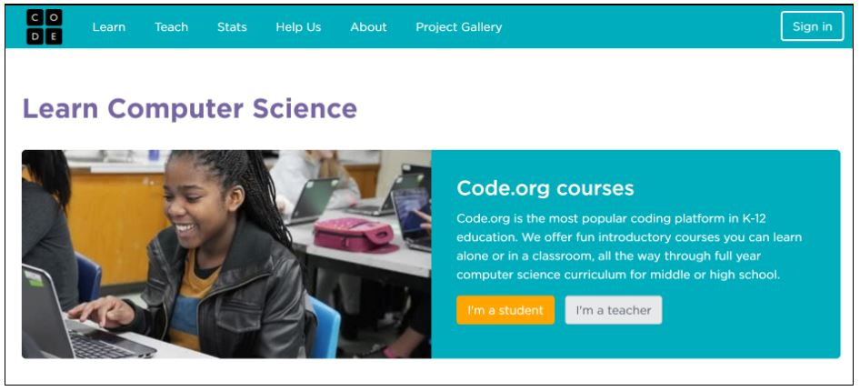
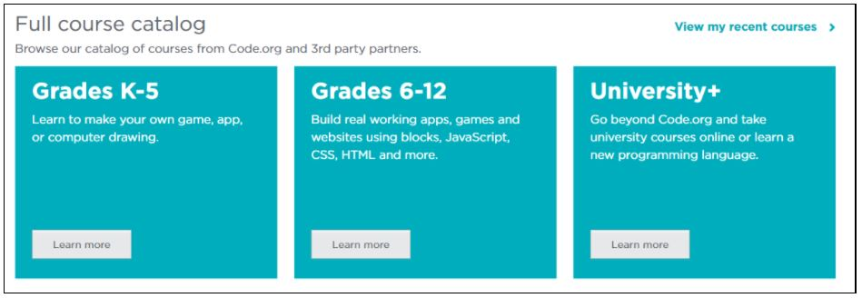
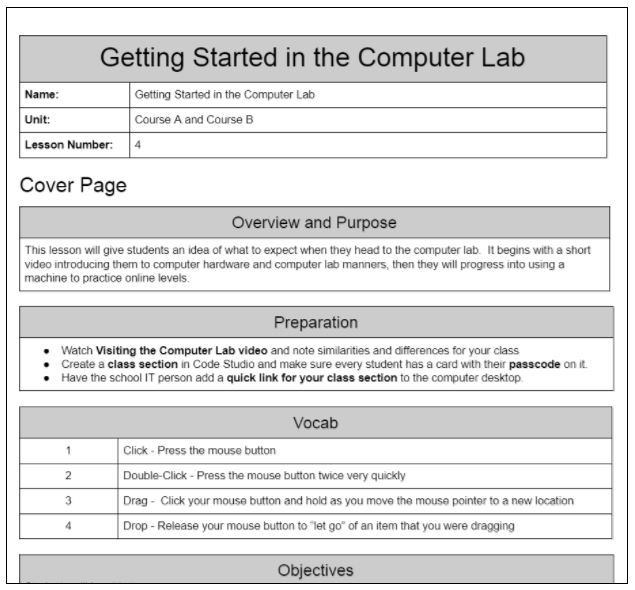
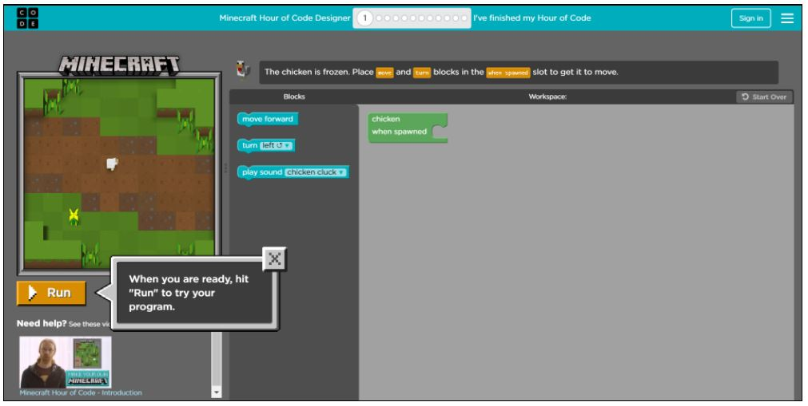

# Project Proposal - DECO3500 - Social and Mobile Computing

<b>BBD</b>

Divyanshi Vashist - 43540697  
Barney Whiteman - 43948378  
Bethany Willis - 43594850  
  

<h2>1. Introduction</h2> In some shape or form, technological advancements shape and control just about every aspect of our lives today. As a result children today are growing up in a very different world than previous generations. Currently in Australia more than 90% of the workforce will need digital skills to perform their roles and in the next 2-5 years 60% of students will be studying or training for positions that will become largely automated [1]. Thus in this digital age it’s important for students to start learning how to program from a younger age.

However when trying to do so we are faced with a few challenges such as:
- It’s not easy to get young children to not only learn such complex concepts but also get them to take interest in programming. 
- Not all teachers are equipped with the skills to teach programming

The solution? Codeverter, a collaborative web application for primary school children which helps to develop their programming and team based learning skills.

<h2>2. Concept</h2>
<h3>2.1 Aims and Audience</h3>
The initial idea behind Codeverter was to make learning how to code within classrooms a more social experience for not only the students but also the teachers with the aim to boost interest and participation. 

The web app targets primary school students from years 3 through to 6 and teachers of all technical skill levels. With a younger and older student age range being a potential stretch goal.

<h3>2.2 Project Outline</h3>
In 2013 over 99% of Australian students had access to a computer at home and 98% had access to the internet <i>(statistics may variate for different age groups)</i>[2]. Statistics as such suggested that a web application would be an appropriate platform for Codeverter to run upon.

Basically, a teacher creates their own profile on Codeverter and creates a “classroom” that their students will sign-on to with their own accounts. Codeverter allowed the teachers to then assign tasks for the students to work upon.

There are different types of activities that require different levels of teamwork and collaboration. 
- <u>Individual activities:</u> Activities that requires students to work independently. For example:
      Activities for students to complete at home as a form of homework
      Individual learning, assessment and practice mode
- <u>Group activities:</u> Activities that require students to form small teams/pairs and work together to learn and solve problems.
- <u>Class activities:</u> Activities that require students to form small teams and work together or compete with other teams. For example:
      All teams work together to solve a bigger problem. For example each team works on a coding challenge and upon completion they add a puzzle piece to the classroom’s jigsaw board. The class works together to finish the jigsaw puzzle.  
      Teams compete against each other to quickly finish coding challenges to for example win the car race. 

We also understand that different year levels will require the content to be delivered in different ways and to be of certain levels of difficulty. 
    Years 3-4
- Content will focus more on learning the basic concepts and developing a certain way of thinking and problem solving that will prepare students for when they actually start learning code.
- A majority of the challenges will use visual representations of code such as building blocks and by the end students translating the visuals to pseudo code. 
    Years 5-6
- Content will harder and go into more detail as appropriate for this older age range of students.
- Will start of with pseudo code however will then progress into translating that into real programming languages.

Trying to integrate Codeverter into classes also means that we need help support the teachers too. On their profile a teacher can indicate their own programming skills level. Based on this information they can select to give Codeverter a certain amount of support and control to teach the classroom.  So for teachers that aren’t so proficient at coding Codeverter can take more control over the teaching and also provide more support and guidance to the teacher in relation to their lesson and activity plans on the site.  A possible form of support would be provide easy and quick learning material for teachers study beforehand. 

<h3>2.3 Codeverter and Current Offerings</h3>

Code.org shares a similar goal to Codeverter in giving students the opportunity to learn computer science. 
The below Code.org screen shots show a few features that both Codeverter and Code.ord share. 

Codeverter like Code.org tries to support not only the teachers but also the students. 

Code.org like Codeverter provides support for multiple year levels. However Codeverter is currently aimed for primary school children only. This will allow the primary school year levels to be broken up even further unlike Code.org that has just K-5. This will allow the modules to be even more customised and specific for each year level.

Code.org provides lesson plans for teachers as seen above. However this is where Codeverter greatly differs from Code.org. Rather than a written documents describing lesson plans that the teacher then needs to somehow organise themselves Codeverter makes this process more easier and interactive.

Within Codeverter a teacher profile has control over a virtual classroom where all the student accounts are enrolled to. The teacher can drag and drop activities into this classroom that students have to complete at home or during class. This allows the teacher to control the entire classroom from their own screens. Allowing them to make sure children stay focused and on track especially during class as there is a known issue that technology can also have the tendency to distract students from work rather than facilitate it.  

This differs from Code.org where teachers just follow the lesson plan, then deliver lengthy instructions to students and then have to walk around and check every student’s screen to make sure students are working on the right modules. 

This is one of the many Code.org activities. We can see that students can work in individually, in pairs and groups to complete such activities. However we can see from the above screen shot that:
The teacher has no communication or control over what the students are doing
Everyone works on the same activities with no interaction happening between students working on other computer screens i.e. limited collaboration. 

This is where Codeverter comes in. As stated in the project outline Codeverter’s biggest goal is to make this a social learning experience. 
Just to reinstate Codeverter activities will allow:
The teacher to participate along with the students and have some form of control.
The class to work together from their own individual screens.
For example the main screen that the teacher projects to the class can display the bigger problem e.g. a jigsaw puzzle. Then each student’s screen is assigned a smaller chunk of the problem i.e. they each have a jigsaw piece however in order to place that on the main screen they need to complete the coding challenge. So for every challenge that a students complete they win a puzzle piece to add to the classroom jigsaw puzzle. Therefore the whole class works together to finish the bigger problem. 

  
<h2>3. Team</h2>

<h3>3.1 Workload and Responsibilities</h3>
As the team contains only 3 people we decided that having an assigned team leader would not be as effective. Thus the responsibilities of a team leader will be shared amongst each other. The success of the team will rely on all members being proactive and contributing to all aspects of the project. However each team member will be given the responsibility to look over certain area of the project.  The tasks have been divded up and assigned, and can be viewed here https://docs.google.com/document/d/1Ix1n-yNkbbL5i0OrrpfA3fJs8UUIx8AYnu5faTTNcuQ/edit?usp=sharing.

<h3>3.2 Group Decisions</h3>
Group decisions will be discussed as a team and determine by a “majority rules” vote.
As there are three team members a majority vote cannot end in a tie, thus decisions will always have an outcome.

<h3>3.3 Resolving Conflict</h3>

If a team member doesn’t uphold the ground rules agreed upon, conflict will be resolved by:
1 - A polite email will be send to the group member outlining the issue. This gives that member the opportunity to respond and provide an explanation.
2 - If their defence is not satisfactory and conflict still exists then a team meeting will be organised. All team members must be present to together discuss and address the issue. 
3 - After giving the offending member a second chance, if they have still not rectified the situation then the team will consult with one of the course staff to discuss what action should then be taken.

<h3>3.4 Handling Underperformance</h3>
If a member underperforms or presents subpar work quality then the group will together discuss how the individual's responsibilities and workload can be reallocated and redistributed in order to ensure fairness for all team members. If the individual after being given the opportunity to make a fair contribution does not then the team will speak to a member of the course staff and seek help on deciding what action needs to be taken next. 

<h2>4. Communications</h2>

<h3>4.1 Team Meetings</h3>
Every week the team will meet for 2 hours during the scheduled workshop on Tuesdays from 12-2pm. Here we will be able to discuss any issues and do progress checks to ensure all team members are on track for deadlines and goals.
If necessary, additional meetings can be planned and scheduled through the teams slack channel.

<h3>4.2 Communication and File Sharing</h3>

The team has a slack channel (in the DECO3500 team) named BBD, however most communiation will be over a Facebook group chat as we found we used Facebook more frequently.

While Slack does allow for file sharing, we have instead opted for a combination of Google Drive and GitHub.
The Google Drive will be used for all items that do not need version control and will have multiple concurrent contributors (e.g. reports), while the GitHub repository will be utilised for all of the actual project files. The version control will make it easy to ensure each member is contributing and to check progress and adhere to milestones.

<h3>4.3 File Naming Conventions</h3>

All files will be given descriptive names in camel case. Naming with a date/time stamp is not necessary as files will be under version control and changes to the files will include the date and time.

<h2>5. Plan</h2>
1. Establishing the Requirements (Weeks 5 - 6)  
- Research, identify and understand the target users and their different sub-categories.  
- Understand their needs through data gathering and analysis.  
- Research/test all assumptions and decisions made.  
 -Analyse similar product offerings   
2. Design alternatives (Weeks 7 - 8)  
- Create possible design solution that meet the requirements   
- Produce conceptual and concrete model for the product  
- Get users to evaluate the model  
3 Low fidelity Prototyping (Weeks 9 - 10)  
- Paper prototype several designs and conduct initial user testing and evaluation  
- Use FluidUI to make a basic prototype for user testing  
- Start the electronic prototype from html
4 Electronic prototype (11 - 12)  
- Flesh out the electronic prototype and start user testing it
- Develop the electronic prototype based on results of user testing
5 Evaluating (Weeks 12 - 13)  
- Analyse the chosen design based on usability and user experience criterias.   
- Make the promotional material.  

<h2>6. Tags</h2>
#socialLearning #webApplication #digitalClassrooms #social #primaryEducation #youngProgrammers #education

<h2>7. References</h2>
[1] <i>Foundation for Young Australians. (2015). The new work order: ensuring young 
Australians have skills and experience for the jobs of the future, not the past.</i>
[2] <i>Thomson, Sue. (June 2015). Australian Students in a Digital World. Policy Insights, 
Issue 3. Melbourne: ACER.</i>
